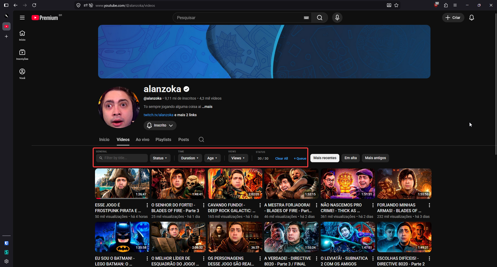

# ytsift

[](https://opensource.org/licenses/GPL-3.0)

<!-- README-I18N:START -->

**English** | [Português (Brasil)](./README.pt-BR.md)

<!-- README-I18N:END -->

A lightweight userscript that adds keyword search, duration, views, and watch-state filters directly to YouTube channel pages. It also lets you batch-enqueue visible videos into your watch queue.



---

### Heads up: How it works (and why it's slow)

This script runs entirely in your browser. It doesn't query a custom backend — it just filters videos *after* YouTube loads them on the page.

* **YouTube's Sorting Rule**: YouTube forces video fetching in its native order (Latest, Popular, or Oldest). The script hides videos that don't match your filters, but they still get downloaded over the network.
* **Why you have to scroll**: If you set very strict filters (e.g. videos with >1M views), you might see an empty list. Just scroll down; as YouTube loads more pages, the script will catch them and display the matches.
* **The 1.5s Throttle**: If your screen is empty, YouTube's scroll listeners will try to spam requests to get more content. To prevent CPU lag and avoid getting your IP rate-limited or temporarily blocked by YouTube's servers, we throttle fetches to once every 1.5 seconds. You'll notice a slight delay when scrolling.

---

## What it does

* **Keyword Search**: Quick title searching with support for negative keywords (e.g., `tutorial -shorts` hides anything containing "shorts").
* **Watch Progress Filter**: Instantly hide videos you've already watched (or partially watched) using a simple percentage threshold slider.
* **Duration Sliders**: Pick minimum and maximum video lengths or use quick presets (**Short**, **Medium**, **Long**).
* **Views Filter**: Mapped range sliders to filter views from 0 up to 10M+ without crowding high values.
* **Upload Age**: Filter by relative age (e.g., `1w` to `6mo`). Works in both English and Portuguese channel layouts.
* **Add to Queue**: A `+ Queue` button enqueues all visible videos at once (using a 150ms delay between items to keep YouTube's internal command router happy).
* **Native Theme**: Inherits YouTube's native design tokens (`--yt-sys-color-*`). Light and dark mode support is built-in.

## Installation

1. Install a userscript manager extension:
   * [Violentmonkey](https://violentmonkey.github.io/) (Recommended)
   * [Tampermonkey](https://www.tampermonkey.net/)
   * [Firemonkey](https://addons.mozilla.org/firefox/addon/firemonkey/)
2. Click here to install: **[ytsift.user.js](./ytsift.user.js?raw=1)**

## Local Development

1. Clone the repo:
   ```bash
   git clone https://github.com/your-username/ytsift.git
   ```
2. Install dependencies:
   ```bash
   pnpm install
   ```
3. Enable "Allow access to file URLs" in your userscript manager's extension settings so you can test changes locally.
4. Build the userscript:
   ```bash
   pnpm build
   ```
   For automatic rebuilds while editing:
   ```bash
   pnpm build:watch
   ```
5. Validate the project:
   ```bash
   pnpm validate
   ```

## License
GPL-3.0. See [LICENSE](LICENSE) for details.
